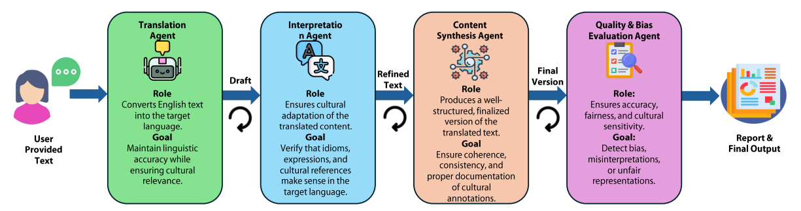

# **Preserving Cultural Identity with Context-Aware Translation Through Multi-Agent AI Systems**
- **Authors:** Mahfuz Ahmed Anik, Abdur Rahman, Azmine Toushik Wasi, Md Manjurul Ahsan 
- Accepted in [**NAACL 2025** Workshop on Language Models for Underserved Communities](https://lm4uc.github.io/)


**Abstract:** Language is a cornerstone of cultural identity, yet globalization and the dominance of major languages have placed nearly 3,000 languages at risk of extinction. Existing AI-driven translation models prioritize efficiency but often fail to capture cultural nuances, idiomatic expressions, and historical significance, leading to translations that marginalize linguistic diversity. To address these challenges, we propose a multi-agent AI framework designed for culturally adaptive translation in underserved language communities. Our approach leverages specialized agents for translation, interpretation, content synthesis, and bias evaluation, ensuring that linguistic accuracy and cultural relevance are preserved. Using CrewAI and LangChain, our system enhances contextual fidelity while mitigating biases through external validation. Comparative analysis shows that our framework outperforms GPT-4o, producing contextually rich and culturally embedded translations—a critical advancement for Indigenous, regional, and low-resource languages. This research underscores the potential of multi-agent AI in fostering equitable, sustainable, and culturally sensitive NLP technologies, aligning with the AI Governance, Cultural NLP, and Sustainable NLP pillars of Language Models for Underserved Communities.




---


## Instructions
#### 1.  Start LLM Server for LLM Inference

a. **Install Ollama:**

   ```bash
   curl -fsSL https://ollama.com/install.sh | sh
   ```

   **Explanation:** This command downloads and executes the Ollama installation script directly from their official website. The `curl` command fetches the script, and the `-fsSL` flags ensure that the process is silent and fails gracefully if any issues arise. Piping (`|`) the output to `sh` executes the script, installing Ollama on your system.

b. **Start the Ollama Server and Download the Llama3 Model:**

   ```bash
   ollama serve & ollama pull aya-expanse:8b
   ```

   **Explanation:** The first part, `ollama serve &`, starts the Ollama server in the background, allowing it to handle requests without occupying the terminal. The ampersand (`&`) ensures that the server runs as a background process. The second part, `ollama pull aya-expanse:8b`, downloads the Llama3 model to your local machine, making it available for use with Ollama.

c. **Install LiteLLM with Proxy Support:**

   ```bash
   pip install 'litellm[proxy]'
   ```

   **Explanation:** This command uses `pip`, the Python package installer, to install LiteLLM along with its proxy capabilities. The `'litellm[proxy]'` notation specifies that the proxy feature should be included during installation.

d. **Start the LiteLLM Proxy Server with the Ollama Llama3 Model:**

   ```bash
   litellm --model ollama/aya-expanse:8b
   ```

   **Explanation:** This command launches the LiteLLM proxy server, specifying the use of the `ollama/aya-expanse:8b` model. The proxy server facilitates interactions with the specified model, providing a unified interface for handling requests. ([LiteLLM - Getting Started | liteLLM](https://docs.litellm.ai/docs/proxy/quick_start?utm_source=chatgpt.com))

#### 2. Prepare Environment
Install required packages.

```
pip install colab-xterm duckduckgo-search
pip install crewai==0.28.8 crewai_tools==0.1.6 langchain_community==0.0.29
```

#### 3. Run The Agent
Now, run the script.

```
python main.py
```

---

### Cite as:

```
@inproceedings{
anonymous2025preserving,
title={Preserving Cultural Identity with Context-Aware Translation Through Multi-Agent {AI} Systems},
author={Mahfuz Ahmed Anik and Abdur Rahman and Azmine Toushik Wasi and Md Manjurul Ahsan},
booktitle={NAACL 2025 Workshop on Language Models for Underserved Communities},
year={2025},
url={https://openreview.net/forum?id=RiCfefEHII}
}
```
